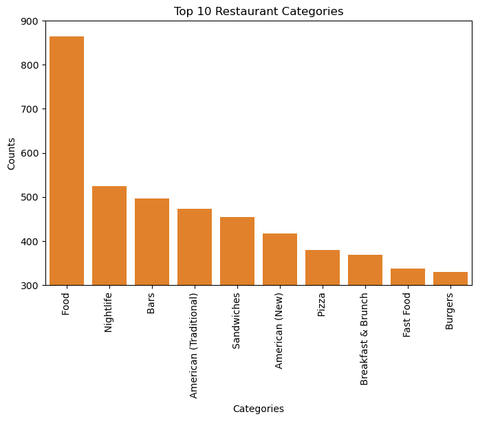
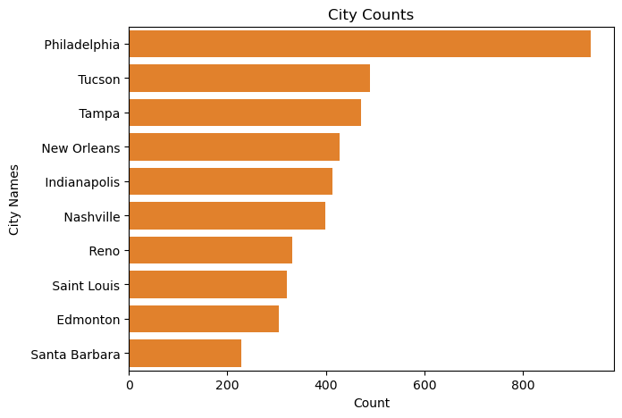
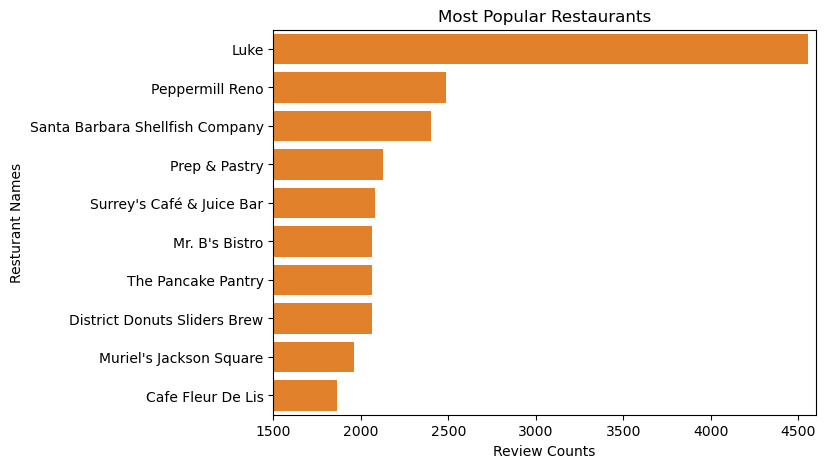
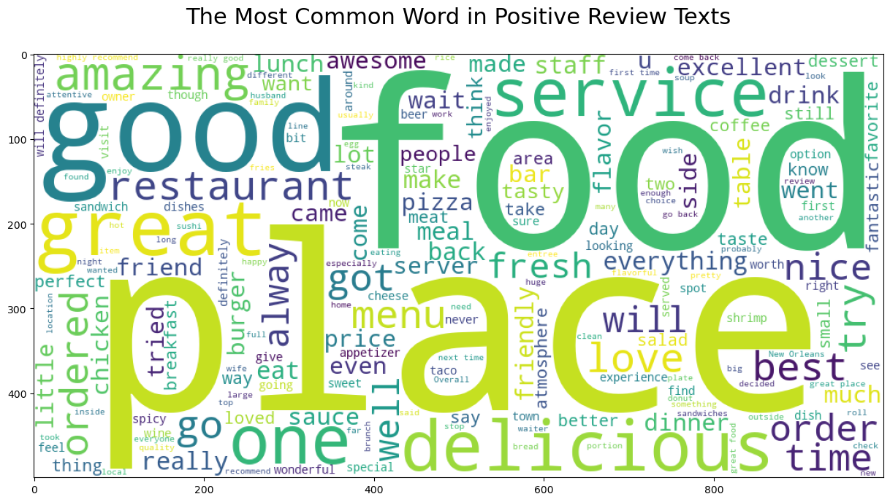

# Food Tourism: Personalized Restaurant Recommendations

## Table Of Contents
1. [Introduction](#introduction)
2. [Problem Statement](#problem-statement)
3. [Business understanding](#Business-understanding)
4. [Data Understanding](#data-understanding)
5. [Data Preparation](#data-preparation)
6. [Data Modeling](#data-modeling)

# Introduction

Savor Space is a growing tourism and travel agency offering a wide range of services; from booking accommodations to providing tour guides and creating personalized travel experiences. Our mission is to ensure that tourists have an enriching and seamless journey hence fully enjoying their destination.

We believe that traveling is about more than just sightseeing,it's also about savoring local cuisines that suit individual tastes. Whether a tourist is looking for traditional dishes, vegan options, or a fine dining experience, finding their preferred restaurant guarantees a satisfying experience. To enhance this specific aspect of their journey, Savor Space is developing a restaurant recommendation system designed to help tourists discover dining spots that align with their preferences,ensuring a memorable and enjoyable culinary experience.

# Problem Statement
Its not easy for a majority of tourists to find restaurants that align with their tastes, especially when visiting unfamiliar locations. Lack of personalized recommendations means that they may rely on random reviews, which do not always reflect their preferences or specific dining needs. The lack of tailored suggestions can negatively impact a tourist's overall experience. The problem Savor Space seeks to solve is how to provide accurate and personalized restaurant recommendations based on individual preferences, allowing tourists to easily find eateries they will enjoy.

#### Stakeholders

* **Savor Space Management:** An interest in offering personalized and innovative services to boost customer satisfaction and retention thus positvely impacting their ROI.

* **Tourists:** They are the primary users of the system. They will benefit from the personalized recommendations

* **Restaurant Owners:** Although they are not directly involved, they may benefit from increased visibility when their restaurant is recommended in alignment with customer preferences.

# Objective

**1. To develop a robust restaurant recommendation system**- that provides personalized suggestions to tourists based on their preferences, dietary restrictions, and location.

**2. To improve tourist satisfaction**- this is done by enabling them discover restaurants that match their individual tastes, enhancing their overall travel experience.

**3. To leverage data science techniques**-these include: Natural Language Processing (NLP) and recommendation algorithms (content-based and collaborative filtering) to ensure accurate and reliable recommendations.

**4. To evaluate and improve the recommendation system**- can be achieved by using advanced models and performance metrics like RMSE to optimize the system's accuracy.

# Business Understanding
Savor Space is a tourism and travel agency that aims to provide a seamless and enriching experience for
tourists. The agency offers a wide range of services, including booking accommodations, providing tour guides, and creating personalized travel experiences. The restaurant recommendation system is a key component of this service, as it enables tourists to discover dining spots that align with their preferences.
# Data understanding
In order to come up with a cutting edge restaurant recommendation system, we opted to get real-time data from Yelp.com. The data was extracted through web scraping and a total of five json datasets were obtained. 

This restaurant recommendation system leverages two  primary datasets namely the **business.json** and the **review.json** as the had relevant information required to develop the recmmendation system.

**1) Business Dataset**

This dataset includes essential information about a variety of restaurants.

**2) Review Dataset**

This dataset provides insights into user preferences and their dining experiences.
# Data preparation
The data was preprocessed to ensure that it was in a suitable format for analysis. This involved the following steps:
1. **Data Cleaning**: Removing any duplicate or irrelevant data.
2. **Data Transformation**: Converting the data into a suitable format for analysis.
3. **Data Normalization**: Scaling the data to a common range to prevent feature dominance.
4. **Data Modeling**

# Exploratory Data Analysis (EDA)
The EDA was performed to understand the distribution of the data and identify any patterns or correlations.
The dataset was analyzed to understand trends, including the distribution of business ratings, popular restaurant categories, and the number of reviews per city. Visualizations such as histograms, box plots, and word clouds were used to illustrate key insights.

This EDA offered vital insights,the differences in the distribution of user ratings and business ratings in the dataset and what do these differences indicate about user preferences?

**Correlation between Rating and B/S Rating**
The correlation value of 0.41 indicates a moderate positive relationship between restaurant or service ratings and B/S Ratings. This suggests that as a business's rating increases, its B/S Rating also tends to rise, implying that higher individual ratings often lead to a better overall rating based on user reviews.
**Distribution of Categories**
What are the most prevalent restaurant categories and how does the distribution of these categories impact the restaurant landscape in terms of user preferences and choices?

**Distribution of Restaurants across the citties and states**
The distribution of restaurants across cities and states is uneven, with some cities having a higher concentration of restaurants.

From the analysis above it is clear that philadephia has the highest number of restaurantst city. Following, but not as closely, is Tampa, indicating a notable restaurant presence. In contrast, the cities of Edmonton and Santa Barbara have fewer restaurants, making them less common in this dataset.
**Popular Restaurants**
The most popular restaurants in the dataset are those with high ratings and a large number of reviews. These restaurants are likely to be well-known and have a strong reputation among users.

**Review Word Cloud Analysis**
The word cloud analysis reveals the most frequently used words in the reviews, providing insights into user preferences.

The word cloud visually represents the most common words found in the positive review texts, where the size of each word in the cloud corresponds to its frequency in the reviews.

# Modeling
In this section we created a recommendation system using the datasets to solve our main problem.
We also did some sentiment Analysis and performed some text preprocessing such as:
-Feature engineering : further feature engineering of the columns to meet the required specifications for analysis eg aggregating text reviews, creating new columns from the existing columns .. etc
- Removal of Punctuations and Removal of Stopwords - we used the **RegexpTokenizer()** method
-  Stemming - reducing words to their root meaning , we used the **SnowballStemmer()** method
- Word-Vectorization - splitting text data into a vector of individual words for further and easier nlp analysis, we used the **TidfVectorizer()** method that vectorizes text data and calculates their respective Term Frequency - Inverse Document Frequency (TI-IDF) values.

## Content-based Recommendation System:
We developed a content-based recommendation system using the cosine similarity matrix to match restaurants with user preferences. By comparing the similarity between different restaurants and the customer's specified attributes, where we can recommend the top N similar restaurants based on their input.

## Deep Neural Networks:
We used  Keras deep neural network to implement a recommendation system and tried to improve our RMSE scores by using neural networks. and got that:
Number of Users:  34497
Number of Restaurants:  3720

The baseline model had a training RMSE of 0.3896 and a test RMSE of 1.3671 hence being our better neural networks model with the lowest test scores.

In all the models SVD emerged to be the best RMSE score of 1.25

## Conclusion
In conclusion, this project successfully developed an interactive and user-friendly restaurant recommendation system that offers personalized dining suggestions while considering various factors influencing restaurant ratings and user preferences. The advanced recommendation algorithm enhances users' dining experiences by providing tailored recommendations.

We achieved specific objectives by designing a user-friendly website for easy interaction with the system and conducting in-depth analyses of the factors affecting restaurant ratings. This understanding helped refine our algorithms to deliver relevant suggestions.

Additionally, we utilized Folium for geographical data visualization, creating interactive maps that highlight geographic trends in restaurant recommendations. These maps make the experience more engaging and help users discover new dining options in their preferred areas.

Overall, this project has effectively delivered a comprehensive restaurant recommendation system, enabling users to access personalized suggestions based on various factors and geographical trends, thus enhancing their dining experiences.

## Recommendations
* User Feedback Integration: Actively gather and incorporate user feedback to enhance the recommendation system.

* Improved User Profiles: Utilize collected data to deliver more personalized restaurant recommendations.

* Refined Algorithms: Continuously improve the recommendation algorithms by exploring advanced machine learning techniques, including deep learning, to boost accuracy and personalization.

* Geographical Expansion: Gradually broaden the system's geographical coverage to include more regions and cities, offering users a wider selection of dining options.

## Future Improvement Ideas

* Community Engagement: Encourage users to share their dining experiences and reviews. Implement social sharing features to foster a community and facilitate peer recommendations.

* Real-Time Updates: Provide real-time updates on restaurant information, including opening hours, special offers, and menu changes, ensuring users have the latest data.

* Food Delivery Integration: Partner with food delivery services to enable users to order for delivery or pickup directly through the recommendation system.

* Advanced Machine Learning: Investigate advanced machine learning algorithms to further improve recommendation accuracy.

This project was developed by Samuel Gathogo, Andrew Manwa, Elsie Serem, Martin Omondi, Nancy Maina. Contributions are welcome—please fork the repository and submit a pull request with proposed improvements and join the team.S

# License
This project is licensed under the MIT License. 
